<div align="center">


# Контроль задач

**Планирование задач отдела и контроль исполнения:** календарь, недельная матрица плана, доска сроков,
график событий сотрудников, недельные отчёты, показатели эффективности и уведомления — без обращений в интернет.

[](CHANGELOG.md)
[](#проверки)
[](#устройство-проекта)
[](LICENSE)

[Руководство пользователя (PDF)](docs/) ·
[История версий](CHANGELOG.md)

</div>

---

## Содержание

- [Что это](#что-это) · [Возможности](#возможности) · [Разделы приложения](#разделы-приложения)
- [Быстрый старт](#быстрый-старт) · [Команды](#команды) · [Устройство проекта](#устройство-проекта)
- [Данные и сервер](#данные-и-сервер) · [Уведомления](#уведомления) · [Публикация](#публикация)
- [Документация](#документация) · [Проверки](#проверки) · [Версии](#версии) · [Лицензия](#лицензия)

## Что это

Веб-приложение для отдела: задача заводится один раз и сразу видна во всех разделах — в календаре, в недельном
плане, на доске сроков и в отчёте. Руководитель планирует и оценивает, исполнитель ведёт исполнение своих задач.
Интерфейс собран на собственной библиотеке компонентов: календарь дат, выпадающие списки, окна и полосы прокрутки
оформлены в единой теме, стандартные элементы браузера не используются.

<p align="center">
  <picture>
    <source media="(prefers-color-scheme: dark)" srcset="docs/shots/02-calendar-week.png">
    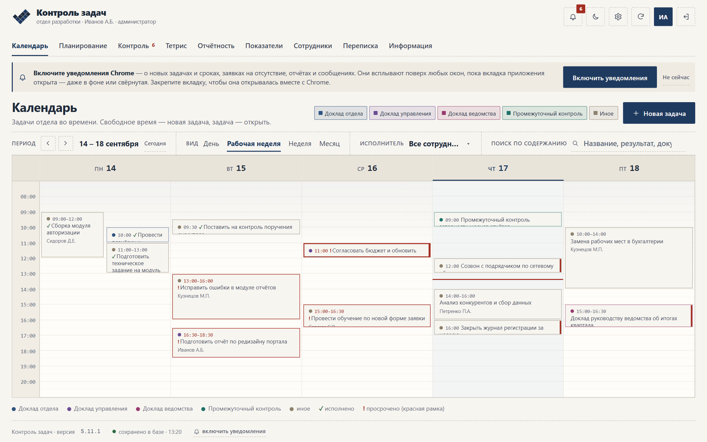
  </picture>
</p>

## Возможности

| | Раздел | Что умеет |
|---|---|---|
| 📅 | **Календарь** | День, неделя, месяц (выбранный вид запоминается). Поиск по содержанию мероприятий, фильтр категорий, цвет события — категория. |
| 🗓 | **Планирование** | Матрица «раздел планирования × сотрудник» на неделю с пятницы по четверг, несколько мероприятий в ячейке, выгрузка CSV и документ по шаблону, отправка недельного отчёта. |
| ⏱ | **Контроль** | Неисполненные задачи в шести колонках по сроку — от просроченных до «В течение квартала»; счётчик просрочки в шапке. |
| 🧩 | **Тетрис** | График событий отдела на месяц: отпуска, командировки, отгулы, больничные, учёба; заявки и согласование, остатки, пик отпусков и пересечения со сроками задач. |
| 📄 | **Отчётность** | Недельный отчёт с закреплённой шапкой, печать, выгрузка CSV и справка по шаблону. |
| 📈 | **Показатели** | Баллы сотрудников за период, динамика по неделям, лидер отдела. |
| 👥 | **Сотрудники и переписка** | Карточка сотрудника с задачами, баллами и отсутствиями; общий канал со счётчиком непрочитанных. |
| 🔔 | **Уведомления** | Всплывающие уведомления Chrome о задачах, заявках, отчётах и сообщениях — без внешних служб. |
| ⚙️ | **Администрирование** | Пользователи и подразделения, роли с настраиваемыми разрешениями, вход по форме или через Windows, словари с цветами, разделы планирования, шаблоны документов. |
| 🌗 | **Оформление** | Тёмная и светлая темы, работа с телефона, собственная библиотека компонентов (`/kit`). |

## Разделы приложения

<table>
<tr>
<td width="50%">

**Планирование** — матрица на высоту окна: шапка с фамилиями и колонка разделов закреплены, точка у фамилии
показывает событие сотрудника на этой неделе.

<picture>
  <source media="(prefers-color-scheme: dark)" srcset="docs/shots/05-planning.png">
  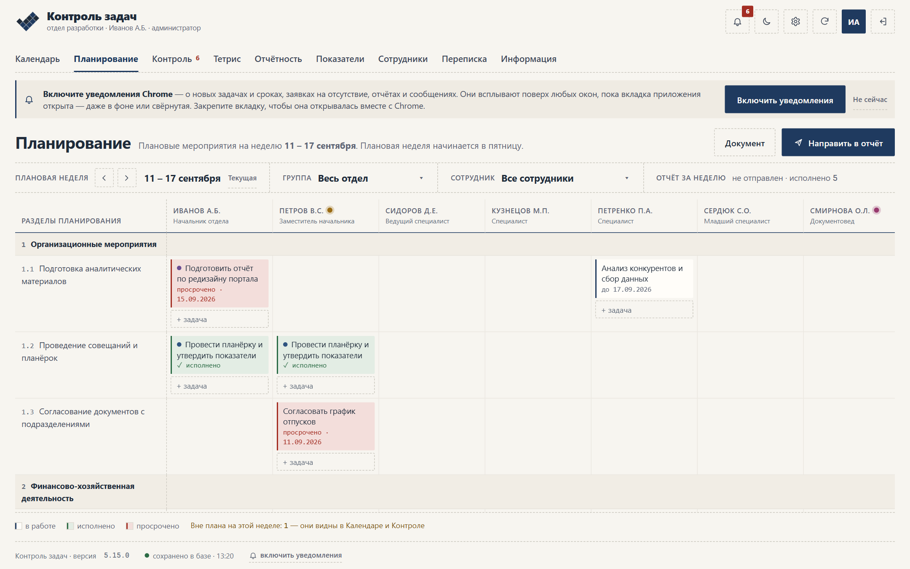
</picture>

</td>
<td width="50%">

**Контроль исполнения** — шесть колонок сроков по три в ряд, сводка над доской, добавление задачи прямо в колонку.

<picture>
  <source media="(prefers-color-scheme: dark)" srcset="docs/shots/07-control.png">
  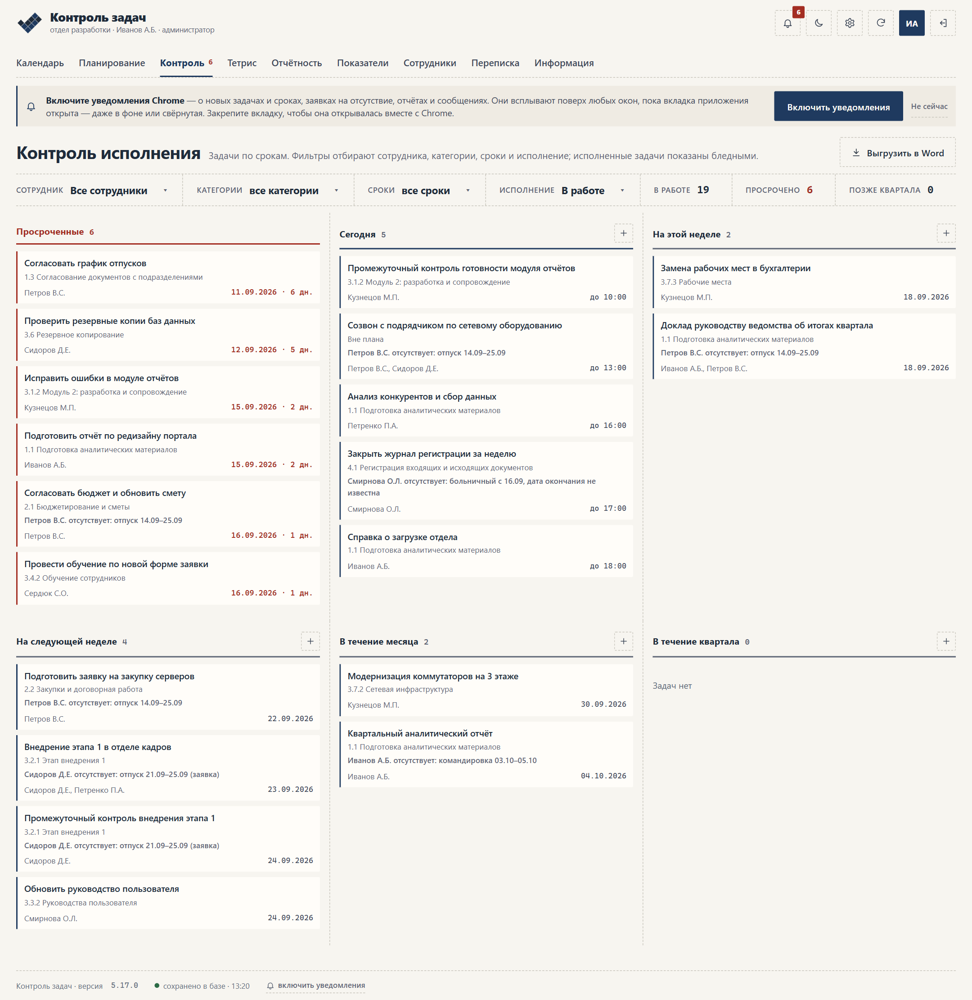
</picture>

</td>
</tr>
<tr>
<td>

**Тетрис** — график событий отдела: полосы по видам, метки сроков задач, строка «Отсутствуют, %»,
список видов и легенда под графиком.

<picture>
  <source media="(prefers-color-scheme: dark)" srcset="docs/shots/19-absences.png">
  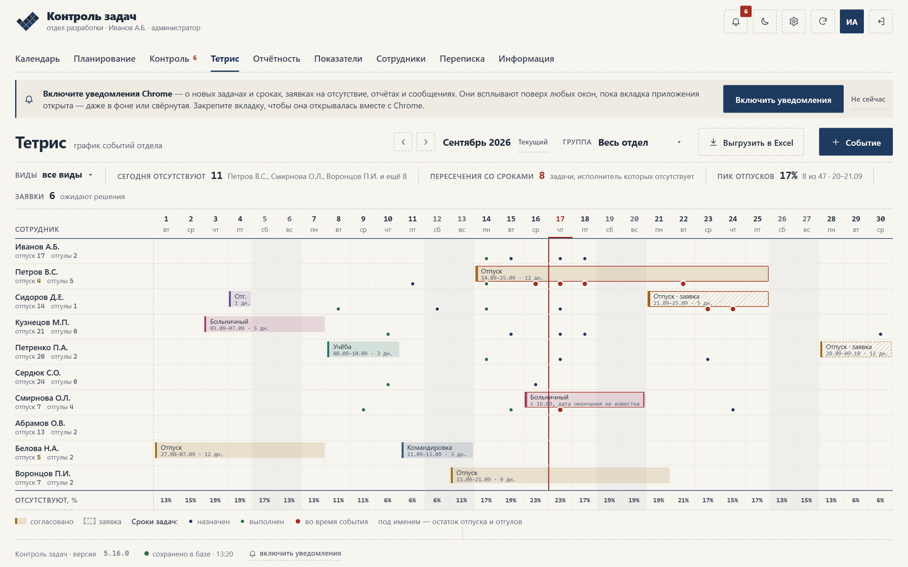
</picture>

</td>
<td>

**Отчётность** — исполненные мероприятия за неделю: закреплены шапка, колонка разделов и итог баллов.

<picture>
  <source media="(prefers-color-scheme: dark)" srcset="docs/shots/08-reports.png">
  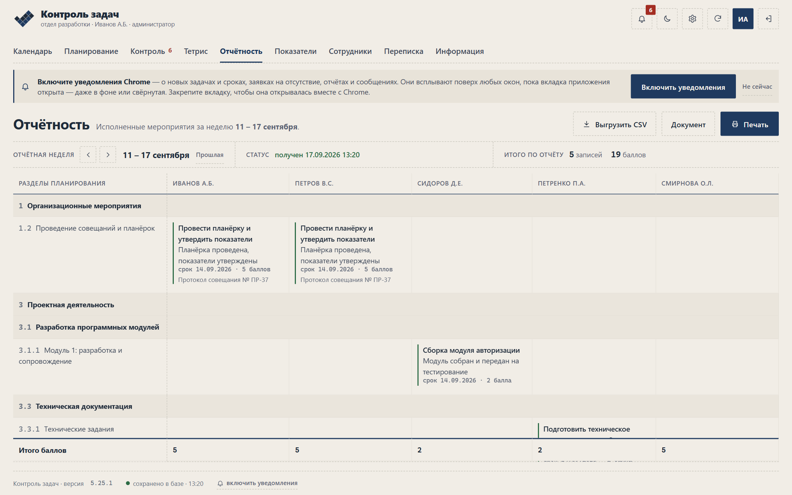
</picture>

</td>
</tr>
<tr>
<td>

**Показатели эффективности** — итоги периода, баллы по сотрудникам и динамика по неделям.

<picture>
  <source media="(prefers-color-scheme: dark)" srcset="docs/shots/09-kpi.png">
  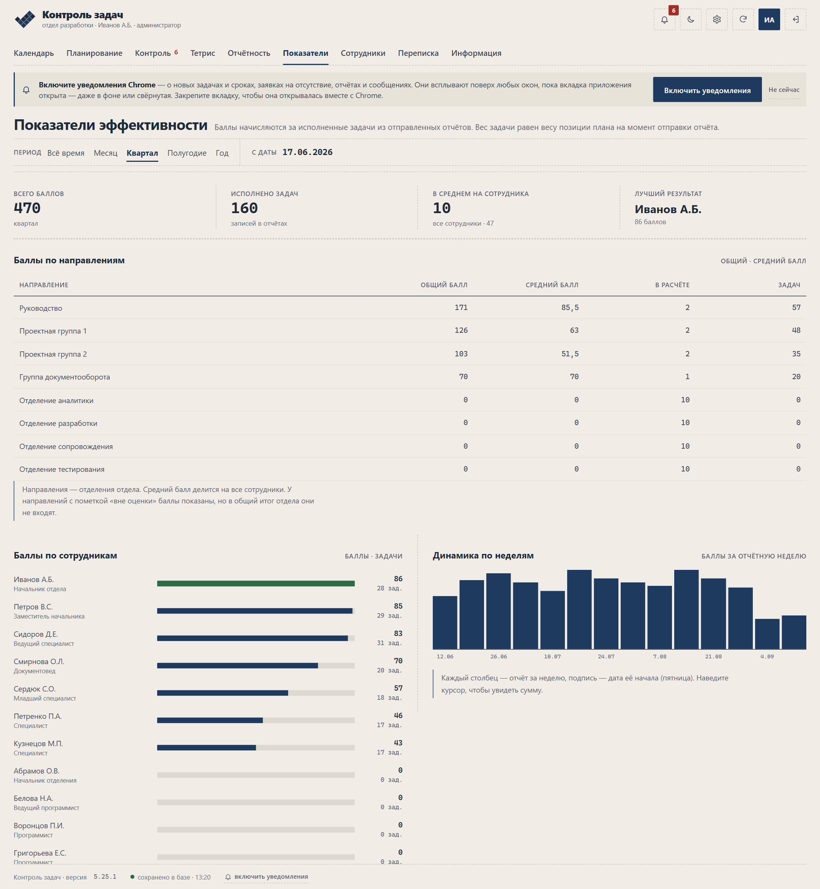
</picture>

</td>
<td>

**Карточка задачи** — одно окно для всех разделов: сроки, раздел планирования, исполнители, результат и баллы.

<picture>
  <source media="(prefers-color-scheme: dark)" srcset="docs/shots/04-task-modal.png">
  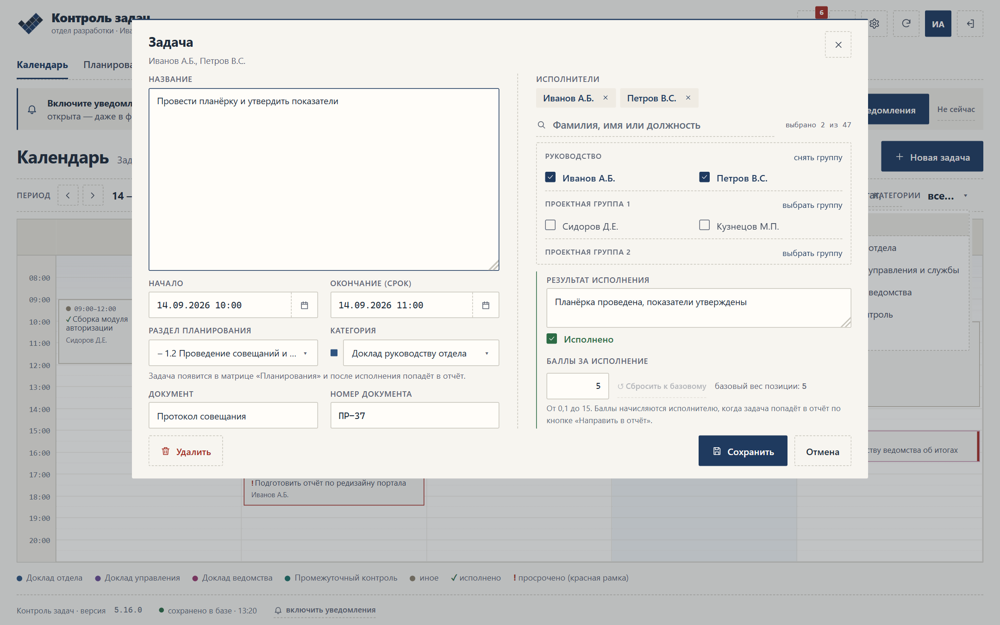
</picture>

</td>
</tr>
<tr>
<td>

**Документ по шаблону** — план мероприятий недели или справка об исполнении: предпросмотр, .doc, .txt и CSV.

<picture>
  <source media="(prefers-color-scheme: dark)" srcset="docs/shots/05c-planning-doc.png">
  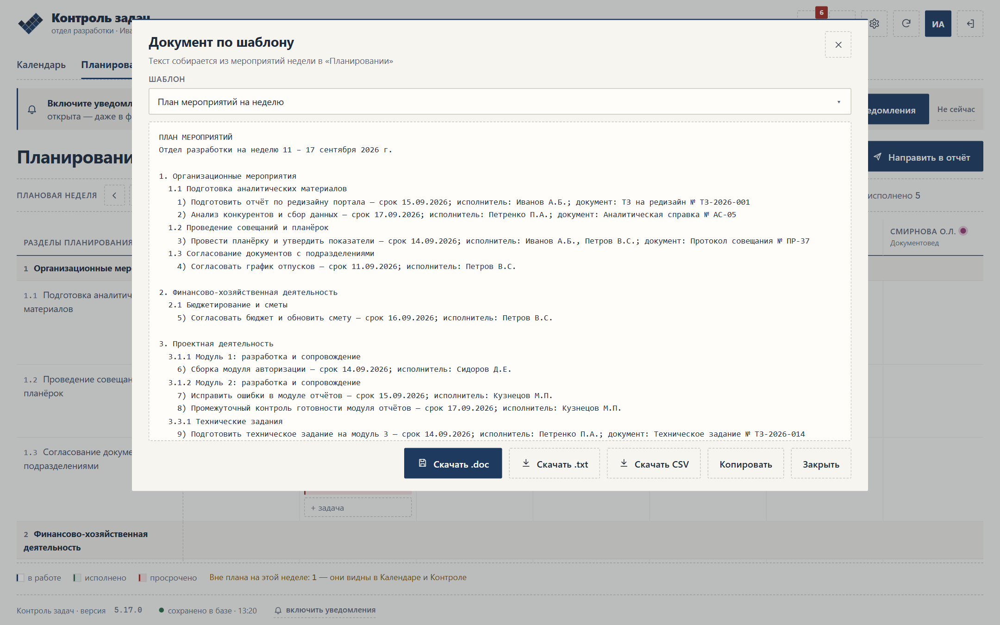
</picture>

</td>
<td>

**Администрирование** — пользователи, подразделения, роли, словари, разделы планирования и шаблоны документов.

<picture>
  <source media="(prefers-color-scheme: dark)" srcset="docs/shots/26-admin-users.png">
  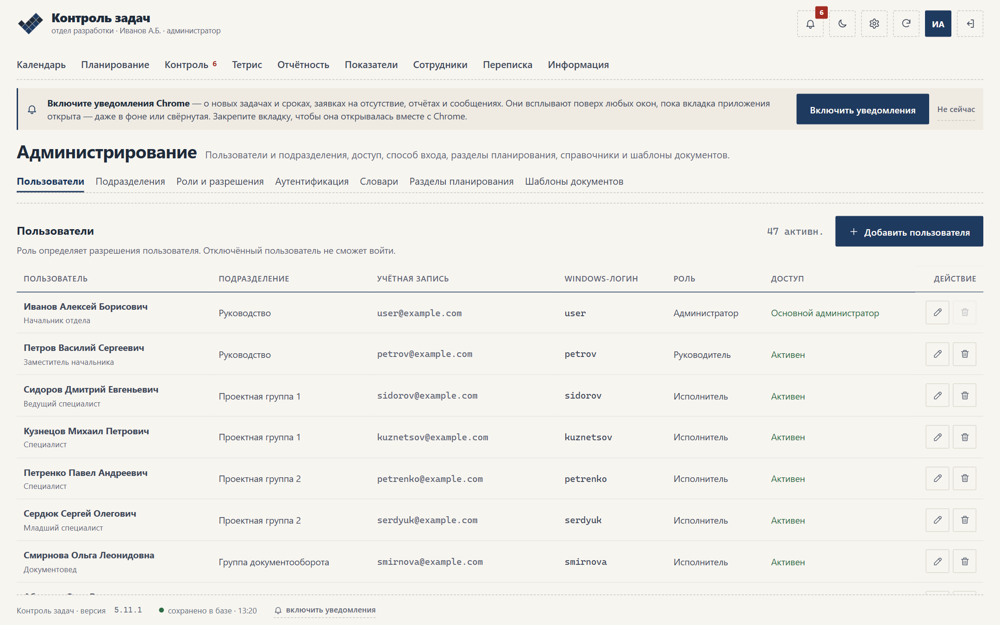
</picture>

</td>
</tr>
</table>

<details>
<summary><b>Ещё изображения</b>: переписка, телефон, библиотека компонентов, вход</summary>

<br>

| Переписка со счётчиком непрочитанных | Библиотека компонентов `/kit` |
|---|---|
| <picture><source media="(prefers-color-scheme: dark)" srcset="docs/shots/11-chat.png">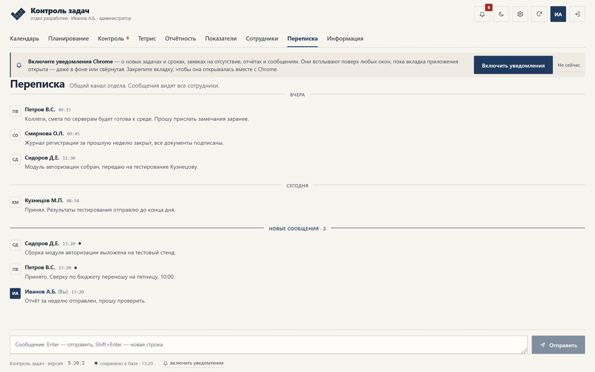</picture> | <picture><source media="(prefers-color-scheme: dark)" srcset="docs/shots/24-kit.png">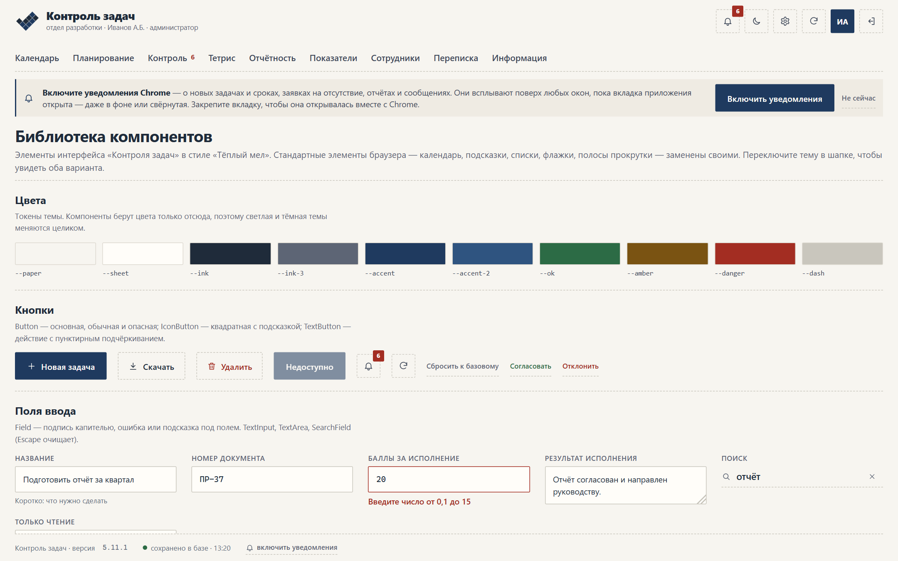</picture> |

| Экран входа | Телефон: контроль и календарь |
|---|---|
| <picture><source media="(prefers-color-scheme: dark)" srcset="docs/shots/01-login.png">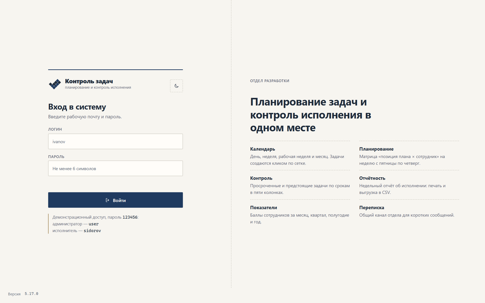</picture> | 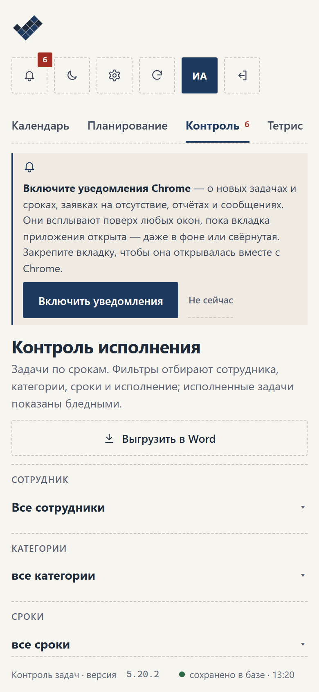 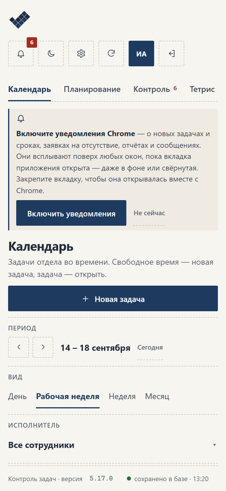 |

Все изображения сняты автоматически: `node docs/shoot.mjs` проходит по разделам в Chrome и сохраняет каждый экран
в двух темах (`имя.png` — тёмная, `имя.light.png` — светлая).

</details>

## Быстрый старт

Нужен Node.js 20.19+ или 22.12+ (проверено на 24).

```bash
git clone <адрес репозитория>
cd task-control
npm install
npm run dev
```

Откройте http://localhost:5173. Данные хранятся только в **SQL Server**: по умолчанию — локальный (`localhost`),
база `TaskControlDev` создаётся сама, вход в SQL Server — учётной записью Windows. Другие настройки — переменные
`MSSQL_*` (например, в `.env.development.local`). Вход в приложение — **только через Windows**: на сервере
разработки это учётная запись, под которой он запущен (`TC_DEV_WINDOWS_USER` — другая); она же становится
администратором пустой базы. Тестовых данных приложение не создаёт.

## Команды

| Команда | Что делает |
|---|---|
| `npm run dev` | режим разработки вместе с API |
| `npm run build` | проверка типов и сборка интерфейса в `dist/` |
| `npm run build:iis` | комплект для публикации в IIS в `dist-iis/` |
| `npm run build:sql` | скрипт создания базы SQL Server `scripts/create-database.sql` из схемы приложения |
| `deploy-iis-remote.bat -Server ИМЯ` | публикация в IIS с другого компьютера сети по WinRM (`-Check` — только проверить сервер) |
| `npm run pack:iis` | архив `release/task-control-iis-<версия>.zip` для переноса на сервер без интернета (комплект + `deploy-iis.bat` + инструкция) |
| `deploy-iis.bat` | публикация в IIS одним файлом: недостающие компоненты, копирование в `C:\inetpub\wwwroot\PLAN`, сайт, пул под учётной записью публикующего, вход через Windows, база SQL Server и сверка её схемы (от имени администратора) |
| `npm run preview` | просмотр собранного интерфейса |
| `npm test` | модульные, интерфейсные и серверные тесты (Vitest) |
| `npm run test:mssql` | тесты хранилища на настоящем SQL Server (`MSSQL_TEST_SERVER`; без `MSSQL_TEST_USER` — вход Windows) |
| `npm run lint` | статический анализ (oxlint) |
| `npm run docs` | тесты, сборка, дымовая проверка в Chrome на 4 ширинах, скриншоты в двух темах и PDF-руководство |

`npm run docs` ищет Chrome или Edge в стандартных путях; другой путь задаётся переменной `CHROME_PATH`.

## Устройство проекта

```
src/
  lib/        модель данных, бизнес-логика, права, даты, уведомления, хранилище (reducer)
  kit/        библиотека компонентов: поля, списки, календарь дат, окна, подсказки
  components/ шапка, карточка задачи, окна и общие элементы приложения
  screens/    экраны разделов
  test/       тесты (Vitest + Testing Library)
server/       HTTP API: маршруты, авторизация, SQL Server, вход через Windows
scripts/      сборка комплекта для IIS, подготовка SQL Server и пула IIS
docs/         исходник руководства, скрипты съёмки и сборки PDF, скриншоты
public/       значки, Service Worker уведомлений, PDF-руководство для скачивания
```

Изменения данных описаны чистым редьюсером `src/lib/reducer.ts`: **один и тот же код выполняется в браузере и
на сервере**, поэтому права проверяются одинаково, а интерфейс обновляется сразу, не дожидаясь ответа сервера.

## Данные и сервер

- Хранилище — **только Microsoft SQL Server** 2016 и новее (проверено на 2025): переменные `MSSQL_SERVER`,
  `MSSQL_DATABASE`; пустые `MSSQL_USER` и `MSSQL_PASSWORD` — вход Windows учётной записью пула IIS (ODBC).
  **Базу создаёт публикация** (`deploy-iis.bat`), **схему сверяет само приложение** при каждом запуске: недостающие
  таблицы, столбцы и индексы создаются, данные не меняются. **Тестовых данных нет**: в пустой базе — справочники,
  роли, шаблоны и разделы плана, администратор — из `TC_ADMIN_LOGIN`. Настройка — [docs/corporate-offline.md](docs/corporate-offline.md).
- API: `POST /api/windows-login`, `GET /api/state`, `POST /api/action`, `GET /api/notices`,
  `GET /api/authentication`, `GET /api/windows-check`, `GET /api/directory-users`, `GET /api/health`.
- Сеанс — подписанный токен (HMAC-SHA256) на 7 дней в заголовке `X-TC-Token`; секрет — `AUTH_SECRET`, иначе выводится из настроек базы.
- Вход — **только через Windows** за IIS (Kerberos/NTLM): формы входа и паролей нет. Поиск сотрудников — в Active Directory.
- Записываются только изменившиеся строки, всё — в транзакции под общей блокировкой.

## Уведомления

Всплывающие уведомления Chrome работают **без интернета и внешних служб**: сервер записывает события в журнал
(`tc_notices`), открытая вкладка приложения — даже в фоне или при свёрнутом браузере — раз в 20 секунд забирает
свои уведомления и показывает их поверх любых окон. Напоминание о просроченных задачах сервер создаёт сам, раз в
день после 9:00. Для уведомлений браузеру нужен защищённый адрес (HTTPS).

## Публикация

Только в IIS корпоративной сети, одним файлом `deploy-iis.bat` на сервере (архив — `npm run pack:iis`):
[docs/corporate-offline.md](docs/corporate-offline.md) — вход через Windows, SQL Server, Active Directory
и установка без обращений наружу.
Стили рассчитаны на Google Chrome 109 — последнюю версию для Windows 7 — и на все более новые браузеры.

## Документация

- **Руководство пользователя** — [docs/manual.html](docs/manual.html) (один источник для PDF и раздела
  «Информация» в приложении). Собранные PDF лежат в [docs/](docs/), последний — версии 5.11.2.
- **Раздел «Информация»** в приложении: то же руководство с оглавлением, скриншоты переключаются вместе с темой,
  рисунок открывается крупно по нажатию.
- **Отчёт об изменениях** со скриншотами — [docs/Контроль-задач-изменения-v5.1.0-5.3.0.pdf](docs/).
- **Анимация логотипа «Ступени»** — самостоятельный пример на HTML/CSS/JS: [docs/logo-steps.html](docs/logo-steps.html).

## Проверки

| Проверка | Значение |
|---|---|
| Тесты (Vitest) | 285 и 19 на настоящем SQL Server — логика, права, интерфейс, API, SQL Server (схема и её сверка), уведомления, логотип, вход через Windows, выгрузка в Excel |
| Типы | `tsc` без ошибок, строгий режим |
| Линтер | oxlint без замечаний |
| Браузер | `npm run docs` проходит разделы на ширинах 375, 768, 1024 и 1440 и сообщает об ошибках консоли, горизонтальной прокрутке и мелких кнопках |

## Версии

Семантическое версионирование **MAJOR.MINOR.PATCH**: MAJOR — смена модели данных, ролей или облика,
MINOR — новые возможности, PATCH — исправления. Версия хранится в `package.json` и видна в подвале приложения,
на экране входа и на обложке руководства. История — [CHANGELOG.md](CHANGELOG.md).

Перед выпуском:

```bash
npm test && npm run lint
npm version minor --no-git-tag-version   # или patch / major
# дописать CHANGELOG.md, при необходимости обновить документацию: npm run docs
git commit -am "5.x.y: краткое описание"
git tag v5.x.y
```

## Лицензия

[MIT](LICENSE) © 2026 GamoffVad
